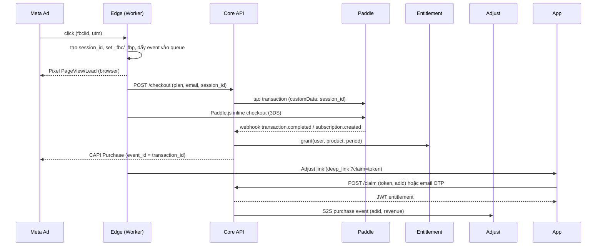
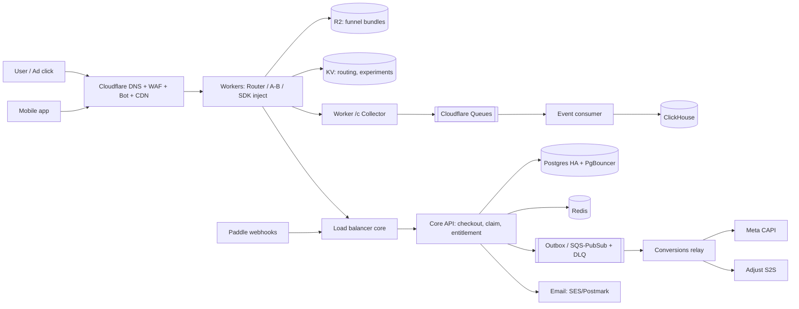

# iKame Funnel Platform (FunnelFox in-house) — Master Plan

> **For agentic workers:** Đây là **master plan** (roadmap + kiến trúc + hạ tầng + nguồn lực). Platform gồm nhiều subsystem độc lập, nên mỗi subsystem sẽ có **plan TDD riêng** (xem §10). Khi thực thi một subsystem: REQUIRED SUB-SKILL: superpowers:subagent-driven-development hoặc superpowers:executing-plans, steps dùng checkbox (`- [ ]`).

**Goal:** Xây platform nội bộ để publish funnel web (quiz → paywall → checkout), thu tiền qua Paddle, rồi chuyển user sang app (**web2app**) hoặc sang sản phẩm web (**web2web**). Platform có attribution về Meta và Adjust, có A/B test và dashboard doanh thu, chịu được traffic lớn từ ads, và thay dần FunnelFox.

**Architecture:** Funnel là bundle HTML tĩnh (đúng format `funnel-content-writer` đang sinh) được phục vụ từ edge của Cloudflare. Mỗi bundle được nhúng **Runtime SDK** để nối contract sẵn có (`emit`, `checkoutUrl`, `IkFunnel.completePurchase`, `?paid=`) với backend. Hệ thống tách thành hai đường:
- **Đường nóng** (HTML, session, event): chạy hoàn toàn ở edge, event đẩy vào queue rồi ghi xuống ClickHouse, **không chạm Postgres**.
- **Đường giao dịch** (checkout, webhook Paddle, entitlement, claim app): lưu lượng thấp nhưng cần đúng tuyệt đối, chạy trên core services với Postgres.

**Tech Stack:** TypeScript xuyên suốt · Cloudflare (DNS, WAF, CDN, Workers, KV, R2, Queues, Turnstile) · Core trên **AWS us-east-1**: Node.js (Fastify) chạy ECS Fargate ARM sau ALB · RDS PostgreSQL 17 + RDS Proxy · ElastiCache Valkey · SQS + DLQ · ClickHouse Cloud (AWS us-east-1) · **Paddle Billing** (Merchant of Record, Paddle.js inline checkout) · **Adjust** (deferred deep link + S2S) · **Meta Pixel + Conversions API** · Next.js cho Admin · Terraform + GitHub Actions · Playwright và k6 để test.

**Spec:** chưa có spec chính thức. Plan này đóng vai trò spec cấp 1. Mỗi subsystem cần chạy `superpowers:brainstorming` → spec → plan TDD trước khi code.

## Global Constraints

- **Paddle là Merchant of Record:** Paddle lo thuế, hóa đơn và receipt. Không tự tính VAT. Mọi domain chứa checkout phải được **Paddle duyệt** trước khi dùng.
- **Tự xây toàn bộ entitlement và identity**, không dùng RevenueCat.
- Attribution:
  - Web dùng Meta Pixel + CAPI, dùng chung `event_id`.
  - App dùng Adjust: deferred deep link để claim, và S2S event cho purchase, renewal, refund.
- Funnel HTML hiện có phải chạy **không sửa**, chỉ được inject Runtime SDK.
- Không đưa email/PII vào URL hoặc event gửi ra ngoài. Gửi sang CAPI thì hash SHA-256.
- Không chạm dữ liệu thẻ: chỉ dùng Paddle.js.
- Mọi webhook Paddle phải **idempotent** theo `event_id` và xử lý được khi đến sai thứ tự (dựa vào `occurred_at`).
- Đường nóng không ghi Postgres. Mỗi lượt visit không tạo row nào trong DB giao dịch.
- p95 TTFB trang funnel < 200ms toàn cầu, phục vụ từ edge cache.
- Phải chạy được trong **in-app browser của FB, IG và TikTok**.

## Review Focus

1. **In-app browser:** Paddle overlay hoặc 3DS bị chặn trong webview FB/TikTok, và Apple Pay không có trong webview → dùng inline checkout, có nút "mở bằng trình duyệt". Thuộc E2E của Billing plan.
2. **Webhook Paddle trùng hoặc sai thứ tự:** ví dụ `subscription.updated` đến trước `subscription.created` → không được cấp quyền 2 lần, không được bắn Purchase 2 lần. Cần test replay trong Billing plan.
3. **Đếm trùng Purchase trên Meta:** web Pixel/CAPI và Adjust→Meta (app event) cùng báo một purchase → cần chọn một nguồn sự thật cho mỗi loại campaign. Cần test trong Conversions plan.
4. **Đã trả tiền nhưng không vào được app:** mất deferred link, sai email, cài trên máy khác → cần đường phục hồi (email OTP, mã restore). Cần test trong Web2App plan.
5. **Traffic burst khi bật campaign** (gấp 10 lần bình thường trong vài phút) và **card testing** đánh vào checkout → edge chịu tải, có Turnstile và rate limit. Kiểm chứng bằng load test k6 trong Infra plan.

---

## 1. Bối cảnh và tài sản sẵn có

| Đã có | Dùng lại thế nào |
|---|---|
| ~60+ funnel HTML (`funnel/funnel-development/**/demo.html`) | Dùng làm "funnel bundle" của MVP, nên **chưa cần editor** |
| Contract engine: `emit('checkout_click'|'offer_accept'|…)`, `CONFIG.checkoutUrl`, `IkFunnel.completePurchase`, `?paid=` | Runtime SDK hook vào đúng các điểm này |
| `funnel/tools/lint_funnel.py`, `smoke_demo.mjs`, `build_export.py` | Đưa vào publish pipeline làm gate |
| App đã tích hợp Adjust SDK | Dùng cho deferred deep link và S2S, không cần thêm MMP |
| Team growth đang chạy Meta | Là user nội bộ đầu tiên, có traffic thật để pilot |

**Chiến lược:** FunnelFox vẫn chạy các funnel hiện tại. Platform in-house chạy song song: pilot 5–10% traffic, so CVR/ARPU, rồi mới migrate dần.

## 2. Phạm vi tính năng

| Nhóm | MVP (P1) | P2 | P3 |
|---|---|---|---|
| Hosting/publish | Upload bundle, versioning, nhiều domain, rollback | Geo/locale routing | Editor + AI generate |
| Checkout | Paddle inline: subscription, trial, intro price, giá địa phương của Paddle | Upsell sau purchase (one-time charge trên subscription), last-chance offer | PSP dự phòng |
| Entitlement | User, subscription và quyền theo product, tự xây | Grace period, pause, đổi gói | Hợp nhất với IAP store |
| Web2App | Adjust deferred deep link + claim token, email OTP | QR desktop → mobile | |
| Web2Web | Magic link, API check entitlement | SSO nhiều product | |
| Attribution | Meta Pixel + CAPI | Adjust S2S (purchase/renew/refund) | Gửi pLTV |
| Experiment | — | Split theo version ở edge, sticky | Auto-winner |
| Analytics | Drop-off theo step, CVR, revenue | Cohort LTV, refund/chargeback rate | Theo creative |
| Self-care | Trang hủy subscription (gọi Paddle API) | Portal đầy đủ | |

## 3. Luồng chính

- **Renewal, refund, chargeback:** Paddle gửi webhook (`transaction.completed`, `adjustment.created`, `subscription.canceled`) → cập nhật entitlement → gửi S2S sang Adjust và CAPI nếu cần.
- **Web2Web:** sau purchase, redirect sang web product kèm magic link (một lần, TTL 15 phút). Web product gọi `GET /entitlements` bằng server key.

## 4. Kiến trúc thành phần

| Service | Chạy ở | Trách nhiệm |
|---|---|---|
| **Edge Router** | Worker | Map domain+path → version, A/B bucket, inject SDK, tạo session_id |
| **Collector** | Worker | `POST /c` nhận batch event → Cloudflare Queues |
| **Event Consumer** | Worker hoặc container | Queue → ClickHouse (batch insert) |
| **Publisher** | Core | Nhận bundle, chạy lint + smoke, đẩy lên R2, cập nhật routing KV |
| **Runtime SDK** `ikf.js` | Browser | Hook `emit`, lưu click id, Pixel, gọi checkout, gửi event qua sendBeacon |
| **Checkout API** | Core | Tạo transaction Paddle, gắn session và attribution |
| **Billing Webhooks** | Core | Verify chữ ký Paddle, ghi inbox, state machine subscription |
| **Entitlement + Identity** | Core | User, OTP, claim token, JWT entitlement, magic link |
| **Conversions Relay** | Core worker | Outbox → Meta CAPI, Adjust S2S, có retry và DLQ |
| **Admin Console** | Core + Next.js | Funnel, domain, price mapping, experiment, dashboard |
| **App SDK** | iOS/Android | Đọc Adjust deferred deep link, claim, OTP, cache JWT |

## 5. Nguồn lực (con người)

| Vai trò | P0–P1 | P2 (traffic lớn) | Trách nhiệm chính |
|---|---|---|---|
| PM/PO | 1 | 1 | Scope, nghiệm thu, cầu nối với growth và finance |
| Tech Lead (BE) | 1 | 1 | Kiến trúc, billing, review |
| Backend | 2 | 3 | Checkout, webhooks, entitlement, relay |
| Frontend | 1 | 2 | SDK, edge workers, admin |
| Mobile | 1 (iOS+Android part-time) | 1 | App SDK, Adjust deep link |
| QA | 1 | 1.5 | E2E sandbox Paddle, webview thật, load test |
| **DevOps/SRE** | 1 | **2** | IaC, CI/CD, Cloudflare, DB, observability, on-call |
| Data | 0.5 | 1 | ClickHouse, dashboard, đối soát Paddle |
| Designer | 0.5 | 0.5 | Admin, checkout UX, trang hủy |
| **Tổng** | **~9 FTE** | **~13 FTE** | |

Hỗ trợ bán thời gian:
- **Finance:** onboarding Paddle, duyệt domain, đối soát payout.
- **Legal:** auto-renew disclosure, trang hủy, GDPR consent, Apple 3.1.1.
- **CS/Risk:** xử lý refund và dispute. Paddle là MoR nhưng vẫn có thể khóa tài khoản nếu chargeback cao.

## 6. Roadmap

### P0 — Discovery (2 tuần)

- [x] PSP: Paddle (MoR) · Entitlement: tự xây · MMP: Adjust · Web tracking: Meta Pixel
- [ ] Xác nhận với Paddle rằng các niche (AI companion/romance, astrology, AI photo) **được chấp nhận**, và quy trình duyệt domain hàng loạt. Owner: PM + Finance
- [x] Cloud cho core: AWS
- [ ] Ước lượng traffic thực tế (sessions/ngày, peak, DAU của các app) để chọn tier hạ tầng ở §12. Owner: PM + Growth
- [ ] Chọn app pilot (web2app) và product pilot (web2web). Owner: PM
- [ ] Tính hòa vốn so với FunnelFox, gồm cả phí Paddle (xem §12.6). Owner: PM
- [ ] Spec cho từng subsystem. Owner: Tech Lead

### P1 — MVP (10–12 tuần)

| Tuần | Deliverable | Owner |
|---|---|---|
| 1–2 | Terraform, CI/CD, 3 môi trường, Cloudflare zone, Paddle sandbox | DevOps |
| 1–3 | Edge Router + Publisher + rollback | FE + BE + DevOps |
| 2–4 | Runtime SDK + Collector + Queue + ClickHouse | FE + Data |
| 3–6 | Checkout API + Paddle webhooks + state machine | BE ×2 |
| 5–7 | Entitlement/Identity: OTP, claim, JWT, magic link | BE |
| 5–8 | App SDK + Adjust deep link trong app pilot | Mobile |
| 6–8 | Conversions relay: Meta CAPI (dedup), Adjust S2S | BE |
| 7–9 | Admin v1 + dashboard | FE + Data |
| 8–10 | Trang hủy subscription, email OTP và magic link | FE + BE |
| 9–12 | Load test 10× peak, test webview thật, security review, **pilot 5–10% traffic** | QA + DevOps |

**Exit P1:** pilot chạy ≥ 2 tuần · CVR không thấp hơn FunnelFox quá 10% · lệch doanh thu giữa dashboard và Paddle < 1% · ≥ 98% user đã trả tiền vào được app · 0 lần cấp quyền trùng · edge không lỗi khi chịu peak.

### P2 — Scale (8–10 tuần)

- A/B ở edge, báo cáo có kiểm định thống kê
- Upsell và last-chance offer (đúng house rule "smaller one-time pass")
- Portal tự phục vụ, grace period
- Multi-region DR cho core, read replica, ClickHouse scale-out
- Migrate dần funnel từ FunnelFox

### P3 — Tự phục vụ

- Editor dựa trên schema SCREENS/CONFIG + AI generate, template, LTV, pLTV
- PSP dự phòng (Stripe) để giảm rủi ro phụ thuộc một nhà cung cấp

## 7. Chiến lược test

| Lớp | Nội dung | Công cụ |
|---|---|---|
| Unit | State machine subscription, dedup, ký JWT/claim token | Vitest |
| Contract | SDK ↔ toàn bộ demo.html hiện có | Playwright + `smoke_demo.mjs` |
| Integration | Replay webhook Paddle (trùng, sai thứ tự, thiếu) | Fixture từ Paddle sandbox |
| E2E | Quiz → Paddle sandbox (3DS, decline) → Adjust link → app unlock | Playwright + Maestro |
| Thiết bị | iOS Safari, Android Chrome, webview FB/IG/TikTok | BrowserStack + máy thật |
| Load | Kịch bản tier đã chọn ×10 (§12.1) | k6 |
| Đối soát | Hằng ngày: Paddle ↔ DB ↔ ClickHouse ↔ Meta/Adjust | Cron + alert Slack |
| Security | Rate limit OTP, Turnstile, verify chữ ký webhook, pentest | OWASP ZAP |

## 8. DevOps / vận hành

- Terraform cho Cloudflare + cloud. Các môi trường: `dev / staging (Paddle sandbox) / prod`
- CI: lint, test, build SDK. Deploy Worker theo kiểu gradual (canary %), core dùng rolling deploy
- SLO:
  - Edge 99.99%
  - Checkout API 99.9%
  - Webhook xử lý < 60s
  - CAPI gửi < 5 phút
- On-call cho billing từ khi bắt đầu pilot. Runbook cho: Paddle down, webhook backlog, domain bị Meta flag, DB failover

## 9. Rủi ro chính

| Rủi ro | Giảm thiểu |
|---|---|
| Paddle từ chối niche hoặc khóa tài khoản (phụ thuộc một PSP) | Xác nhận ở P0, giữ FunnelFox song song, P3 thêm Stripe dự phòng |
| Phí cố định $0.50 của Paddle ăn mạnh vào gói weekly giá thấp | Ưu tiên gói 4 tuần / trial trả tiền ≥ $9.99, tính lại pricing (§12.6) |
| Mỗi domain mới phải chờ Paddle duyệt | Duyệt trước một pool domain, chỉ checkout trên domain đã duyệt |
| Domain funnel bị Meta flag | Pool domain, tách theo app, warm-up |
| Đếm Purchase hai lần (web CAPI + Adjust→Meta) | Quy ước nguồn sự thật cho từng loại campaign |
| Apple từ chối app | App chỉ claim/login, không có link hay giá mua web trong app |

## 10. Các plan TDD con

1. `2026-10-05-ikf-infra-aws.md`: Terraform, Cloudflare, ECS, RDS, SQS, observability (**làm đầu tiên, đã viết**)
2. `…-edge-router-publisher.md`
3. `…-runtime-sdk-collector.md`
4. `…-billing-paddle.md`
5. `…-entitlement-identity.md`
6. `…-app-sdk-adjust.md`
7. `…-conversions-relay.md` (Meta CAPI + Adjust S2S)
8. `…-admin-console.md`

## 11. Quyết định đã chốt (2026-10-05)

| Câu hỏi | Quyết định |
|---|---|
| PSP / MoR | **Paddle** (MoR, lo thuế) |
| Entitlement | **Tự xây** toàn bộ |
| MMP | **Adjust** |
| Web tracking | **Meta Pixel** (+ CAPI phía server) |
| Cloud core | **AWS** (us-east-1) |
| Tier traffic | **Tier A** (~100k sessions/ngày) để khởi đầu, thiết kế sẵn cho B. Plan hạ tầng: `2026-10-05-ikf-infra-aws.md` |

## 12. Hạ tầng cho traffic lớn

### 12.1 Giả định tải theo tier

Giả định: 1 session ≈ 30 event, SDK gom thành ~5 request. CVR checkout 2%. Peak = 5× trung bình (burst khi bật campaign). Load test ở 10×.

| | **Tier A** | **Tier B** | **Tier C** |
|---|---|---|---|
| Sessions/ngày | 100k | 1M | 10M |
| Request HTML+event/ngày | ~0.6M | ~6M | ~60M |
| Peak request/s ở edge | ~40 | ~350 | ~3.500 |
| Event thô/ngày (ClickHouse) | 3M | 30M | 300M |
| Checkout thành công/ngày | ~2k | ~20k | ~200k |
| Entitlement check/ngày (DAU app × 3) | 300k | 3M | 30M |
| Peak request/s vào core | ~5 | ~50 | ~500 |

**Lưu ý:**
- Edge (Cloudflare) gánh gần như toàn bộ tải.
- Core chỉ nhận checkout, webhook, claim và entitlement. Ngay cả ở Tier C, tải vào core vẫn khiêm tốn **nếu** đường nóng không chạm DB và entitlement được cache.

### 12.2 Sơ đồ hạ tầng

### 12.3 Danh sách thành phần (bill of materials)

| Thành phần | Dịch vụ (GCP / AWS) | Tier A | Tier C | Vai trò |
|---|---|---|---|---|
| DNS, CDN, WAF, SSL | Cloudflare | Pro | Business/Enterprise (Bot Management) | Chống DDoS, cache HTML |
| Nhiều domain funnel | Cloudflare zones, hoặc Cloudflare for SaaS | 5–10 domain | 50+ domain | Pool domain cho ads |
| Edge compute | Workers + KV + R2 + Queues | Paid plan | Paid + tăng limit | Router, collector |
| Chống bot / card testing | Turnstile + rate limiting rules | ✓ | ✓ | Bảo vệ OTP, checkout |
| Core compute | Cloud Run / ECS Fargate (autoscale) | 2–4 instance (1 vCPU) | 10–30 instance, min warm 5 | API, webhook, relay |
| DB giao dịch | Cloud SQL / RDS Postgres HA | 2 vCPU 8GB | 8–16 vCPU 64GB + 2 read replica | User, subscription, entitlement |
| Connection pool | PgBouncer | ✓ | ✓ | Tránh cạn connection khi autoscale |
| Cache | Memorystore / ElastiCache Redis HA | 1GB | 5–10GB cluster | Cache entitlement, rate limit, OTP |
| Queue | Pub/Sub / SQS + DLQ | ✓ | ✓ | Outbox, relay, retry |
| Analytics DB | ClickHouse Cloud | Dev tier | 2–3 replica, 32GB+ RAM | Event, funnel report |
| Object storage | GCS / S3 | ✓ | ✓ | Backup, export, log lưu trữ |
| Email | SES / Postmark | ✓ | ✓ (dedicated IP) | OTP, magic link |
| Secrets, ký token | Secret Manager + KMS | ✓ | ✓ | Paddle key, CAPI token, JWT key |
| Observability | Sentry + Grafana Cloud/Datadog + Checkly | ✓ | ✓ | Error, metric, uptime |
| CI/CD, IaC | GitHub Actions + Terraform (Atlantis) | ✓ | ✓ | |

### 12.4 Nguyên tắc thiết kế để chịu tải

1. **Edge-first:** HTML là bundle bất biến, cache ở edge (`immutable`), routing đọc từ KV. Lượt visit không đi qua core.
2. **Session sinh ở edge:** Worker tạo `session_id` (ULID) và ghi vào queue. Chỉ khi user bắt đầu checkout mới ghi row vào Postgres.
3. **Event batching:** SDK gom event, gửi bằng `sendBeacon` khi chuyển màn hoặc rời trang. Collector chỉ validate rồi đẩy queue, không xử lý gì thêm.
4. **Entitlement cache nhiều tầng:** app cache JWT có chữ ký (TTL 24h) → Redis → Postgres. Webhook Paddle invalidate cache và gửi silent push nếu cần.
5. **Outbox pattern:** ghi DB và ghi outbox trong cùng một transaction. Relay gửi CAPI/Adjust có retry và backoff, lỗi thì vào DLQ. Paddle hay Meta chậm cũng không ảnh hưởng checkout.
6. **Idempotency mọi nơi:** bảng `webhook_inbox(event_id unique)`, `Idempotency-Key` cho `/checkout` và `/claim`.
7. **Burst:** core để min instance warm, autoscale theo concurrency, có alert khi queue backlog > 1 phút. Load test 10× peak trước mỗi đợt scale campaign.
8. **Bảo vệ:**
   - Turnstile trước khi gửi OTP và trước checkout.
   - Rate limit theo IP và email.
   - WAF chặn ASN datacenter tại endpoint checkout (chống card testing).
9. **DR:**
   - Postgres PITR, RPO ≤ 5 phút, RTO ≤ 1h.
   - Tier C: replica cross-region.
   - ClickHouse có thể rebuild từ archive event trong GCS/S3.

### 12.5 Chi phí hạ tầng ước tính (USD/tháng, chưa gồm phí Paddle)

| | Tier A | Tier B | Tier C |
|---|---|---|---|
| Cloudflare (plan + Workers/Queues/R2) | 100–300 | 300–800 | 2k–5k (Enterprise nếu cần Bot Mgmt) |
| Core compute | 150–300 | 400–1k | 2k–4k |
| Postgres + Redis | 300–500 | 700–1.5k | 3k–6k |
| ClickHouse | 100–300 | 500–1.5k | 3k–8k |
| Observability + email + khác | 200–400 | 500–1k | 1.5k–3k |
| **Tổng** | **~1–2k** | **~2.5–6k** | **~12–25k** |

Môi trường staging cộng thêm khoảng 20–30%.

### 12.6 Phí Paddle — cần đưa vào bài toán giá

- Paddle (gói chuẩn): **5% + $0.50 / giao dịch** (đã gồm thuế, xử lý fraud, MoR)
- Gói $4.99/tuần: phí ≈ $0.75, tức **~15%** doanh thu
- Gói $29.99/tháng: phí ≈ $2.00, tức **~6.7%**
- → Tránh gói weekly giá rất thấp. Nên dùng trial trả phí, sau đó chuyển sang gói 4 tuần hoặc tháng. Ở doanh thu lớn, đàm phán mức phí riêng với Paddle.

### 12.7 Nhân sự vận hành theo tier

| | Tier A | Tier B | Tier C |
|---|---|---|---|
| DevOps/SRE | 1 | 1–2 | 2 + on-call 24/7 luân phiên với BE |
| Data | 0.5 | 1 | 1–2 |
